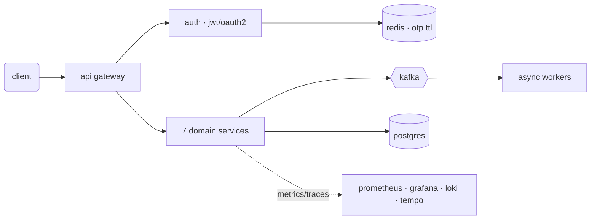

<!--
  ─────────────────────────────────────────────────────────────
  PALETTE (keep consistent everywhere)
  bg      #0D1117   accent  #00FFC6
  text    #8B949E   bright  #C9D1D9
  ─────────────────────────────────────────────────────────────
-->

<p align="center">
  
</p>

<p align="center">
  <a href="https://linkedin.com/in/atulsingh2192"></a>
  <a href="https://leetcode.com/u/atulkumarsingh952"></a>
  <a href="mailto:atulkumarsingh952@gmail.com"></a>
  
</p>

---

## `$ whoami`

```console
atul@backend:~$ whoami
> Backend Engineer @ Cognizant — building for JP Morgan Chase
> java · spring boot · kafka · postgres · redis · aws

atul@backend:~$ cat interests.txt
> consistency, retries, latency, concurrency, distributed failure
> the boring parts of systems that decide whether they survive
```

<table>
<tr><td><code>system failures</code></td><td>&darr; <b>85%</b></td></tr>
<tr><td><code>api latency (p90)</code></td><td><b>2.6s &rarr; 310ms</b></td></tr>
<tr><td><code>retry throughput</code></td><td>&uarr; <b>15%</b></td></tr>
</table>

---

## `$ cat stack.txt`

<p align="center">
  
</p>

```yaml
core:      Java 17 · Spring Boot · Spring Cloud · WebFlux · REST
scale:     Kafka · Redis · microservices · event-driven · outbox · idempotency
data:      PostgreSQL · MongoDB · indexing & query tuning
platform:  AWS · Docker · GitHub Actions · Nginx
observe:   Prometheus · Grafana · Loki · Tempo
```

---

## `$ git log --stat`

<p align="center">
  
  
</p>

<p align="center">
  
</p>

<p align="center">
  
</p>

<!-- optional: activity line graph — uncomment if you want it
<p align="center">
  
</p>
-->

---

## `$ leetcode --stats`

<p align="center">
  
</p>

<p align="center">
  <code>knight · 1844</code> &nbsp;·&nbsp; <code>1500+ solved</code> &nbsp;·&nbsp; <code>900+ gfg</code> &nbsp;·&nbsp; <code>graphs · dp · trees</code>
</p>

---

## `$ ls projects/`

### **switchboard** — distributed microservices platform

7 services behind a gateway, talking over Kafka, fully instrumented. Built to see what actually breaks at scale.



`p90 latency −84%` · `jwt + oauth2` · `redis-backed otp` · `github actions ci/cd` · `docker`

<br>

### **lamicons** — assessment & learning platform

8-service EdTech backend with a real-time coding engine on Judge0, Kafka-driven workflows, and Redis caching. Strategy + adapter patterns so new assessment types plug in without touching the core.

`java 17` · `kafka` · `postgres` · `redis` · `mongodb` · `aws`

---

## `$ tail -f now.log`

```console
> designing retry orchestration for long-running workflows
> reading: designing data-intensive applications (again)
> open to: backend / platform / distributed systems roles
```

<p align="center">
  <sub><code>atulkumarsingh952@gmail.com</code> — always up for a conversation about kafka, failure modes, or a hard system design problem.</sub>
</p>
